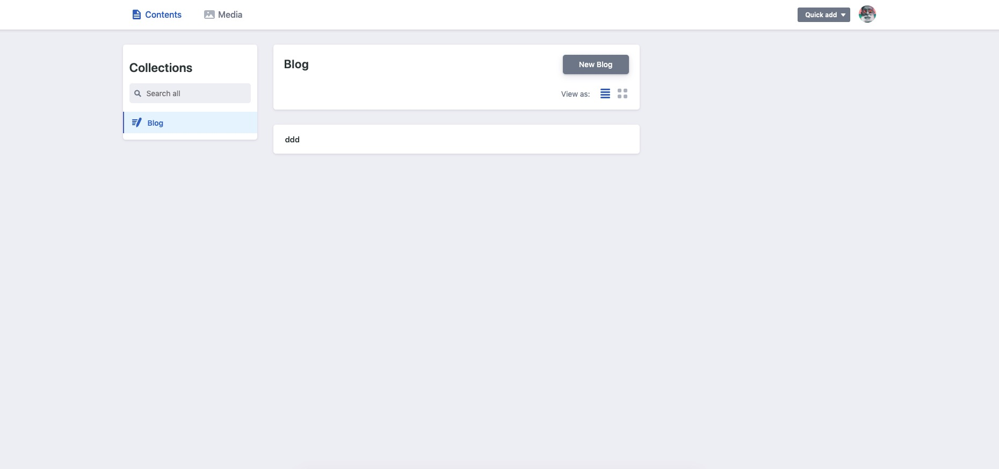

# 使用netlify-cms进行后台博客管理

这两天试了试netfily上的cms系统，感觉上很好用。以前写一篇文章的方法是在本地自己先写好了,然后push到github上。中间这个过程可能只会对我一个人比较友好。但是对于其他的用户写起来，可能就比较晦涩。所以我找到了一个更好的方式去代替这种写博客的方式.

### [**netlify-cms**](https://www.netlifycms.org/)
(**content management for your Git workflow**)

因为我使用的是gatsby来生成我的网站，netlify对这一块还比较友善，有直接的文档来告诉我如何配置

**https://www.gatsbyjs.org/docs/sourcing-from-netlify-cms/** 

#### 1.本地配置

```js
yarn add netlify-cms-app gatsby-plugin-netlify-cms
```
然后找到你的config.js文件里面添加


```js
module.exports = {
  plugins: [`gatsby-plugin-netlify-cms`],
}
```

按照netlify里的文档方法，需要在你的**static/admin/config.yml**写入配置


```js
backend:
  name: test-repo

media_folder: static/assets
public_folder: assets

collections:
  - name: blog
    label: Blog
    folder: blog
    create: true
    fields:
      - { name: path, label: Path }
      - { name: date, label: Date, widget: date }
      - { name: title, label: Title }
      - { name: body, label: Body, widget: markdown }
```

好了到这里就已经在你的本地上算是配置好了你可以启动一下你的服务器来试一试

然后进入 

```js
localhost:8000/admin/
```

就可以看见后台的管理ui界面

#### 2.添加oAuth验证
**https://www.netlify.com/docs/authentication-providers/#using-an-authentication-provider**
这篇文档已经把配置过程写的很详细了但是还是告诉一下大家一些需要注意的

https://github.com/settings/developers

这是在github上注册一个新的 OAuth application 的地址

切记必须要在**Authorization callback URL** 中添加以下地址

```js
https://api.netlify.com/auth/done
```
其他的你可以填入你想要填入的

- 转到Netlify仪表板并单击您的项目。
- 导航到 设置>访问控制>OAuth。
- 在Authentication Providers下，单击Install Provider。
- 选择GitHub并输入客户端ID和客户端密钥，然后保存。

这时等待你的netlify部署更新你的项目，然后在线上地址上访问admin地址即可。你添加的文章会在你的github 地址上创建一个blog文件然后在里面存入你所添加的文章.


